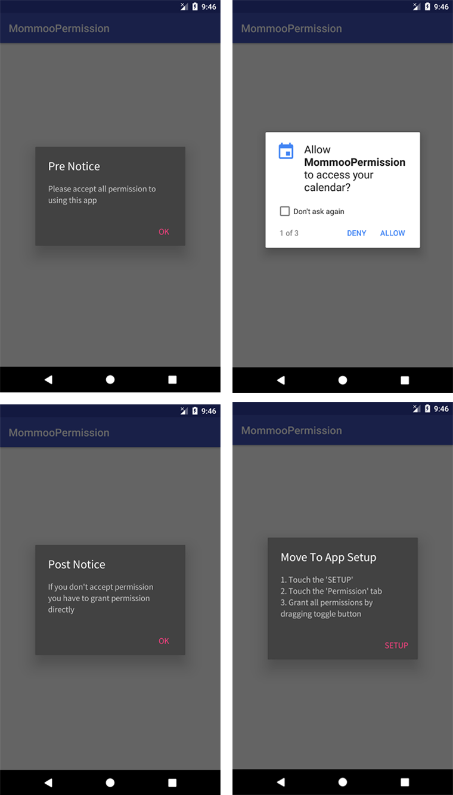

# MommooPermission

Android Permission Library - it is easy to check permissions

# Introduction
After the version of the Android marshmallow, 

We have to declare permission in Manifest.xml file as well as **check permission at runtime**

Also, **User anytime can turn on/off permission in app-setup**,

So **we need to check permission whenever our app have started**

For that, this "MommooPermisson Libaray" can help easy to check permissions


# Example Image



# Set up

### Gradle
```java
dependencies {
    compile 'com.mommoo.android:mommoo-permission:0.1.5'
}
```

# How to use

### Code Example
```java
new MommooPermission.Builder(this)
                .setPermissions(Manifest.permission.WRITE_CALENDAR, 
                        Manifest.permission.CAMERA, 
                        Manifest.permission.READ_CONTACTS)
                .setOnPermissionDenied(new OnPermissionDenied() {
                    @Override
                    public void onDenied(List<DenyInfo> deniedPermissionList) {
                        for (DenyInfo denyInfo : deniedPermissionList){
                            System.out.println("isDenied : " + denyInfo.getPermission() +" , "+ 
                                               "userNeverSeeChecked : " + denyInfo.isUserNeverAskAgainChecked());
                        }
                    }
                })
                .setPreNoticeDialogData("Pre Notice","Please accept all permission to using this app")
                .setOfferGrantPermissionData("Move To App Setup","1. Touch the 'SETUP'\n" +
                        "2. Touch the 'Permission' tab\n"+
                        "3. Grant all permissions by dragging toggle button")
                .build()
                .checkPermissions();
```

### API for cusmizing
#### Show Dialog API

 ```java
 setPreNoticeDialogData(String preNoticeTitle, String preNoticeMessage)
 
 "If use this, app will show pre notice dialog before permission dialog is shown"
 ```
 ```java
 setPostNoticeDialogData(String postNoticeTitle, String postNoticeMessage)
 
 "If use this, app will show post notice dialog after permission dialog is closed"
 ```
 ```java
 setOfferGrantPermissionData(String offerGrantPermissionTitle, String offerGrantPermissionDialog)
 
 "If use this, app will show guide dialog that help user to grant permission direclty at setup screen"
 ```


#### Callback Listener API
 ```java
 setOnPermissionGranted(OnPermissionGranted onPermissionGranted)
 setOnPermissionDenied(OnPermissionDenied onPermissionDenied)
 
 "If user grant or deny permission at permission dialog, OnPermissionXXXX listener would be invoked"
 ```
 ```java
 setOnUserDirectPermissionGrant(OnUserDirectPermissionGrant onUserDirectPermissionGrant)
 setOnUserDirectPermissionDeny(OnUserDirectPermissionDeny onUserDirectPermissionDeny)
 
 "After permission dialog closed, 
 if user grant or deny permission at app setup screen, OnUserDirectPermissionXXX listener would be invoked"
 ```
 
 # License
 ```
 Copyright 2017 Mommoo
 
 Licensed under the Apache License, Version 2.0 (the "License");
 you may not use this file except in compliance with the License.
 You may obtain a copy of the License at
 
 http://www.apache.org/licenses/LICENSE-2.0
 
 Unless required by applicable law or agreed to in writing, software
 distributed under the License is distributed on an "AS IS" BASIS,
 WITHOUT WARRANTIES OR CONDITIONS OF ANY KIND, either express or implied.
 See the License for the specific language governing permissions and
 limitations under the License.
 ```
